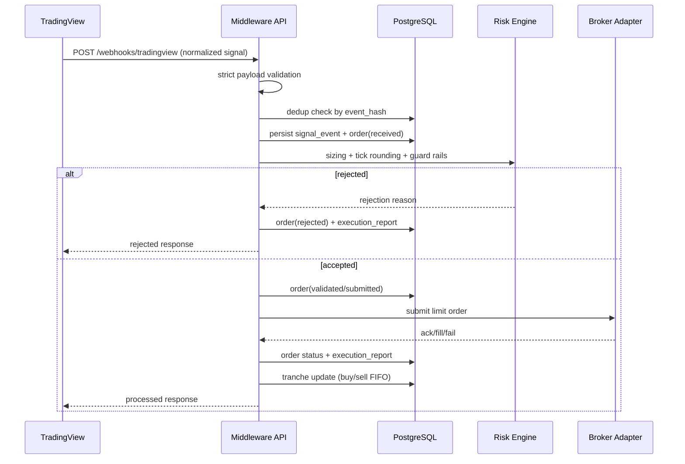

# Rapot Trading Middleware

Production-oriented middleware for routing TradingView webhook signals to broker order execution with strict validation, idempotency, risk guards, FIFO tranche accounting, and audit trails.

## Scope
- Market: Borsa Istanbul spot equities only.
- Buy signals: `H_BLS`, `H_UCZ`, `C_BLS`, `C_UCZ`.
- Sell signals: `H_PAH`, `C_PAH`.
- Max open tranche per symbol: default `4`.
- FIFO sell: oldest open tranche is sold first.
- Default mode: `DRY_RUN` + `MOCK` broker.

## Architecture

Directory layout:
- `middleware/api`: FastAPI app and routes.
- `middleware/domain`: enums, contracts, validation models.
- `middleware/services`: signal ingestion and execution orchestration.
- `middleware/repositories`: persistence/query layer.
- `middleware/risk`: sizing, tick policy, risk checks.
- `middleware/broker_adapters`: broker-agnostic interface + adapters.
- `middleware/infra`: settings, DB, logging, Alembic.
- `middleware/tests`: pytest coverage for core rules.

Sequence:



## TradingView Webhook Contract (Strict)

```json
{
  "source": "Combo+Hunter",
  "symbol": "THYAO",
  "ticker": "THYAO",
  "signalCode": "H_BLS",
  "signalText": "Hunter Beles",
  "side": "BUY",
  "price": 287.25,
  "timeframe": "1D",
  "barTime": 1713772800000,
  "barIndex": 12345,
  "isRealtime": true
}
```

Rules:
- Extra fields are rejected.
- `symbol` must equal `ticker`.
- `signalCode` and `side` must match canonical mapping.
- Duplicate payloads are deduplicated by deterministic `event_hash`.

## Risk and Sizing Rules

Buy:
- `signalBudgetTL = baseBudgetTL * multiplier(signalCode)`
- `buyLimitPrice = round_up_to_tick(close * (1 + buyBps / 10000))`
- `buyLots = floor(signalBudgetTL / buyLimitPrice)`
- If `buyLots < 1`: reject.

Sell:
- `sellLimitPrice = round_down_to_tick(close * (1 - sellBps / 10000))`
- Lot size = `remaining_lots` of oldest open tranche (FIFO).
- If no open tranche: reject.

Guards:
- Supported signal code check.
- Equity-only symbol format check.
- Max open tranche per symbol.
- Optional `max_symbol_exposure_tl`.
- Optional `max_daily_loss_tl`.
- Optional `max_orders_per_day`.
- Live mode requires `TRADING_ENABLED=true`.

## Broker Adapters

- `MockBrokerClient`: fully working, deterministic, test/development default.
- `OsmanliBrokerClient`: secure skeleton only; no undocumented auth/order flow assumptions.

TODO for Osmanli live:
- Implement official token/session bootstrap.
- Implement official order schema and response mapping.
- Implement official cancel/status endpoints.

## Environment Variables

All middleware vars are prefixed with `MW_`.

See `middleware/.env.example`.

Most important:
- `MW_DATABASE_URL`
- `MW_EXECUTION_MODE` (`DRY_RUN` or `LIVE`)
- `MW_TRADING_ENABLED` (`false` by default)
- `MW_BROKER_NAME` (`MOCK` by default)
- `MW_BASE_BUDGET_TL`
- `MW_BUY_BPS`, `MW_SELL_BPS`
- `MW_MAX_OPEN_TRANCHES_PER_SYMBOL`
- `MW_DEFAULT_TICK_SIZE`
- `MW_SYMBOL_TICK_OVERRIDES_JSON`

## Local Setup

1. Prepare env:
   - Copy `middleware/.env.example` and fill values.
2. Install dependencies:
   - `pip install -r requirements.txt`
   - `pip install alembic psycopg[binary]`
3. Run DB migrations:
   - `alembic -c middleware/infra/alembic.ini upgrade head`
4. Start API:
   - `uvicorn middleware.api.main:app --reload --port 8010`

## API Endpoints

- `POST /webhooks/tradingview`
- `GET /health`
- `GET /positions`
- `GET /positions/{symbol}`
- `GET /orders`
- `GET /signals`
- `POST /admin/replay-signal` (dev/admin)
- `POST /admin/simulate-fill` (dev/admin, mock broker)

## cURL Examples

Webhook:

```bash
curl -X POST "http://localhost:8010/webhooks/tradingview" \
  -H "Content-Type: application/json" \
  -d '{
    "source":"Combo+Hunter",
    "symbol":"THYAO",
    "ticker":"THYAO",
    "signalCode":"H_BLS",
    "signalText":"Hunter Beles",
    "side":"BUY",
    "price":287.25,
    "timeframe":"1D",
    "barTime":1713772800000,
    "barIndex":12345,
    "isRealtime":true
  }'
```

List positions:

```bash
curl "http://localhost:8010/positions"
```

Simulate fill:

```bash
curl -X POST "http://localhost:8010/admin/simulate-fill" \
  -H "Content-Type: application/json" \
  -d '{"order_id": 1, "filled_lots": 10, "fill_price": 287.40}'
```

## Broker Switch

- Mock mode (default):
  - `MW_BROKER_NAME=MOCK`
  - `MW_EXECUTION_MODE=DRY_RUN`
- Live integration target:
  - `MW_BROKER_NAME=OSMANLI`
  - `MW_EXECUTION_MODE=LIVE`
  - `MW_TRADING_ENABLED=true`
  - Implement Osmanli official flow in `middleware/broker_adapters/osmanli.py`.
