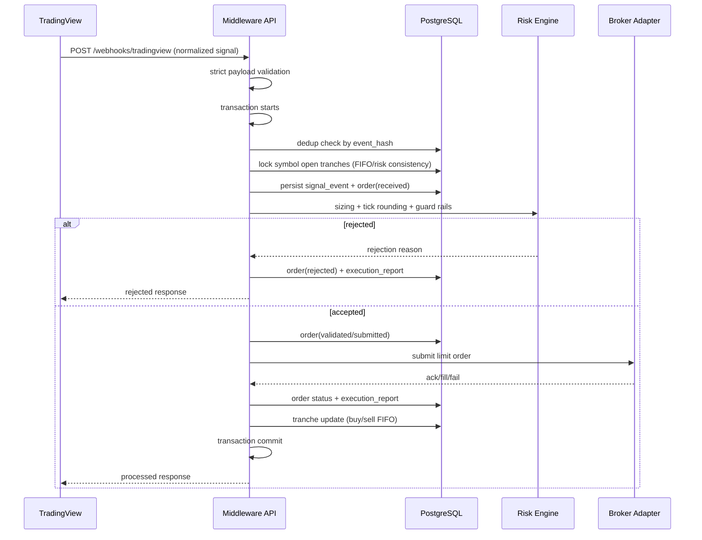

# Rapot Trading Middleware

Production-oriented middleware for routing TradingView webhook signals to broker order execution with strict validation, idempotency, risk guards, FIFO tranche accounting, and audit trails.

## Scope
- Market: Borsa Istanbul spot equities only.
- Buy signals: `H_BLS`, `H_UCZ`, `C_BLS`, `C_UCZ`.
- Sell signals: `H_PAH`, `C_PAH`.
- Max open tranche per symbol: default `4`.
- FIFO sell: oldest open tranche is sold first.
- Default mode: `DRY_RUN` + `MOCK` broker.

## Architecture

Directory layout:
- `middleware/api`: FastAPI app and routes.
- `middleware/domain`: enums, contracts, validation models.
- `middleware/services`: signal ingestion and execution orchestration.
- `middleware/repositories`: persistence/query layer.
- `middleware/risk`: sizing, tick policy, risk checks.
- `middleware/broker_adapters`: broker-agnostic interface + adapters.
- `middleware/infra`: settings, DB, logging, Alembic.
- `middleware/tests`: pytest coverage for core rules.

Sequence:



## TradingView Webhook Contract (Strict)

```json
{
  "schemaVersion": 1,
  "source": "Combo+Hunter",
  "symbol": "THYAO",
  "ticker": "THYAO",
  "signalCode": "H_BLS",
  "signalText": "Hunter Beles",
  "side": "BUY",
  "price": 287.25,
  "timeframe": "1D",
  "barTime": 1713772800000,
  "barIndex": 12345,
  "isRealtime": true
}
```

Rules:
- Extra fields are rejected.
- `schemaVersion` is fixed to `1`.
- `source` must be `Combo+Hunter`.
- `symbol` must equal `ticker`.
- `signalCode` and `side` must match canonical mapping.
- Duplicate payloads are deduplicated by deterministic `event_hash`.
- Optional temporal guards:
  - `MW_MAX_SIGNAL_FUTURE_SKEW_SECONDS`
  - `MW_MAX_SIGNAL_AGE_SECONDS`
  - `MW_REQUIRE_REALTIME_SIGNALS`

## TradingView Real Webhook Setup

TradingView alert webhooks do not support arbitrary custom headers.
For this reason, middleware accepts auth token either from:
- Header: `X-Webhook-Token` (recommended for non-TradingView clients)
- Query parameter: `?token=...` (TradingView-compatible)

Production endpoint pattern:

```text
https://<your-domain>/webhooks/tradingview?token=<MW_WEBHOOK_AUTH_TOKEN>
```

TradingView alert configuration:
1. `Condition`: your indicator alert condition.
2. `Webhook URL`: `https://<your-domain>/webhooks/tradingview?token=<token>`.
3. `Message`: normalized JSON payload expected by middleware.
4. Ensure `Message` is valid JSON and includes required keys exactly.

Security note:
- Keep token high entropy (at least 32 random bytes, hex/base64 encoded).
- Rotate token periodically and after any suspected exposure.

## Risk and Sizing Rules

Buy:
- `signalBudgetTL = baseBudgetTL * multiplier(signalCode)`
- `buyLimitPrice = round_up_to_tick(close * (1 + buyBps / 10000))`
- `buyLots = floor(signalBudgetTL / buyLimitPrice)`
- If `buyLots < 1`: reject.

Sell:
- `sellLimitPrice = round_down_to_tick(close * (1 - sellBps / 10000))`
- Lot size = `remaining_lots` of oldest open tranche (FIFO).
- If no open tranche: reject.

Guards:
- Supported signal code check.
- Equity-only symbol format check.
- Max open tranche per symbol.
- Optional `max_symbol_exposure_tl`.
- Optional `max_daily_loss_tl`.
- Optional `max_orders_per_day`.
- Optional temporal freshness/future-skew guards.
- Live mode requires `TRADING_ENABLED=true`.

## Broker Adapters

- `MockBrokerClient`: fully working, deterministic, test/development default.
- `OsmanliBrokerClient`: secure skeleton + mapper envelope (`osmanli_mapper.py`) only; no undocumented auth/order flow assumptions.
- `Osmanli TradingView JSON proxy`: `/webhooks/tradingview/osmanli-proxy` accepts
  Osmanli/AlgoDirekt TradingView JSON command payloads, extracts the signal intent,
  runs middleware auth/risk/idempotency checks, and keeps outbound forwarding disabled
  by default. When `MW_OSMANLI_FORWARD_ENABLED=true`, only non-duplicate signals that
  pass middleware risk checks are forwarded to `MW_OSMANLI_TV_WEBHOOK_URL`. Forwarding
  preserves the original TradingView request body instead of re-serializing JSON, because
  Osmanli Wizard tokens can be sensitive to the generated message command shape.

TODO for Osmanli live:
- Implement official token/session bootstrap.
- Replace mapper endpoint/field placeholders with official schema.
- Implement response/callback reconciliation and status mapping with official codes.
- Implement official cancel/status endpoints.
- Follow:
  - `middleware/docs/OSMANLI_SANDBOX_UAT_CHECKLIST.md`
  - `middleware/docs/OSMANLI_EXECUTION_MAPPER_FLOW.md`

## Environment Variables

All middleware vars are prefixed with `MW_`.

See `middleware/.env.example`.

Most important:
- `MW_DATABASE_URL`
- `MW_EXECUTION_MODE` (`DRY_RUN` or `LIVE`)
- `MW_TRADING_ENABLED` (`false` by default)
- `MW_BROKER_NAME` (`MOCK` by default)
- `MW_REQUIRE_WEBHOOK_AUTH` (`true` by default)
- `MW_WEBHOOK_AUTH_TOKEN` (**required** when `MW_REQUIRE_WEBHOOK_AUTH=true`)
- `MW_BASE_BUDGET_TL`
- `MW_BUY_BPS`, `MW_SELL_BPS`
- `MW_MAX_OPEN_TRANCHES_PER_SYMBOL`
- `MW_DEFAULT_TICK_SIZE`
- `MW_SYMBOL_TICK_OVERRIDES_JSON`
- `MW_MAX_SIGNAL_AGE_SECONDS`
- `MW_MAX_SIGNAL_FUTURE_SKEW_SECONDS`
- `MW_REQUIRE_REALTIME_SIGNALS`
- `MW_OSMANLI_LIVE_ENABLED`
- `MW_OSMANLI_BASE_URL`
- `MW_OSMANLI_TOKEN_URL`
- `MW_OSMANLI_ACCOUNT_ID`
- `MW_OSMANLI_CLIENT_ID`
- `MW_OSMANLI_CLIENT_SECRET`
- `MW_OSMANLI_REQUEST_TIMEOUT_SECONDS`
- `MW_OSMANLI_TV_WEBHOOK_URL`
- `MW_OSMANLI_FORWARD_ENABLED`
- `MW_OSMANLI_FORWARD_TIMEOUT_SECONDS`

## Local Setup

1. Prepare env:
   - Copy `middleware/.env.example` and fill values.
2. Install dependencies:
   - `pip install -r requirements.txt`
   - `pip install alembic psycopg[binary]`
3. Run DB migrations:
   - `alembic -c middleware/infra/alembic.ini upgrade head`
4. Start API:
   - `uvicorn middleware.api.main:app --reload --port 8010`

## API Endpoints

- `POST /webhooks/tradingview`
- `POST /webhooks/tradingview/osmanli-proxy` (Model A proxy; forward disabled by default)
- `GET /health`
- `GET /positions`
- `GET /positions/{symbol}`
- `GET /orders`
- `GET /signals`
- `POST /admin/replay-signal` (dev/admin)
- `POST /admin/simulate-fill` (dev/admin, mock broker)

## cURL Examples

Webhook:

```bash
curl -X POST "http://localhost:8010/webhooks/tradingview?token=REPLACE_WITH_LONG_RANDOM_TOKEN" \
  -H "Content-Type: application/json" \
  -d '{
    "source":"Combo+Hunter",
    "symbol":"THYAO",
    "ticker":"THYAO",
    "signalCode":"H_BLS",
    "signalText":"Hunter Beles",
    "side":"BUY",
    "price":287.25,
    "timeframe":"1D",
    "barTime":1713772800000,
    "barIndex":12345,
    "isRealtime":true
  }'
```

For non-TradingView clients, header authentication is also supported:

```bash
curl -X POST "http://localhost:8010/webhooks/tradingview" \
  -H "Content-Type: application/json" \
  -H "X-Webhook-Token: REPLACE_WITH_LONG_RANDOM_TOKEN" \
  -d '{ "...": "..." }'
```

Osmanli/AlgoDirekt TradingView JSON command shadow proxy:

```bash
curl -X POST "http://localhost:8010/webhooks/tradingview/osmanli-proxy?token=REPLACE_WITH_LONG_RANDOM_TOKEN" \
  -H "Content-Type: application/json" \
  -d '{
    "symbol": "THYAO",
    "ticker": "THYAO",
    "signalCode": "H_BLS",
    "signalText": "Hunter Beles",
    "side": "BUY",
    "price": 287.25,
    "timeframe": "1D",
    "barTime": 1713772800000,
    "barIndex": 12345,
    "isRealtime": true,
    "apiKey": "OSMANLI_API_KEY_FROM_WIZARD",
    "token": "OSMANLI_TOKEN_FROM_WIZARD"
  }'
```

Notes:
- The proxy does not forward to Osmanli while `MW_OSMANLI_FORWARD_ENABLED=false`.
- If forwarding is enabled, both BUY and SELL are supported, but risk-rejected or
  duplicate signals are not forwarded.
- Forwarding sends the original TradingView JSON body to Osmanli unchanged. Keep the
  Pine alert JSON aligned with the Wizard-generated command fields and token.
- If Osmanli upstream forwarding fails or returns non-2xx, the proxy returns `502`
  so TradingView marks the webhook delivery as failed.
- Wizard secrets are treated as pass-through payload values; do not paste real values
  into repository files or logs.
- Keep `signalCode`, `barTime`, and `barIndex` in the TradingView message where possible
  so middleware can apply canonical signal validation and idempotency.

List positions:

```bash
curl "http://localhost:8010/positions"
```

Simulate fill:

```bash
curl -X POST "http://localhost:8010/admin/simulate-fill" \
  -H "Content-Type: application/json" \
  -d '{"order_id": 1, "filled_lots": 10, "fill_price": 287.40}'
```

## Broker Switch

- Mock mode (default):
  - `MW_BROKER_NAME=MOCK`
  - `MW_EXECUTION_MODE=DRY_RUN`
- Live integration target:
  - `MW_BROKER_NAME=OSMANLI`
  - `MW_EXECUTION_MODE=LIVE`
  - `MW_TRADING_ENABLED=true`
  - Implement Osmanli official flow in `middleware/broker_adapters/osmanli.py`.
